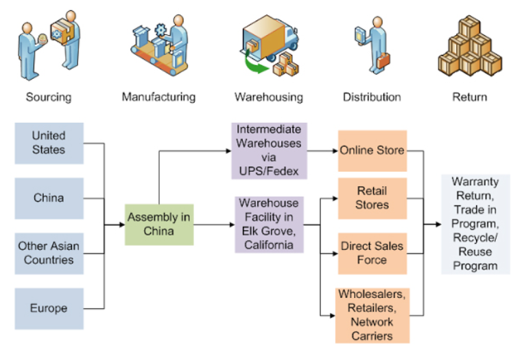

# Apple Supply Chain Operation 

`Apple's Online Store`
- Apple purchases components and materials from various `suppliers`
- Then gets them shipped to the assembling plant in `China`
- From there, products are shipped directly to consumers (Via Fedex/UPS) who order's from `Apple's Online Store`

`Retail Stores`
- Apple keeps products at `California` (Central warehouse and call center are located) and ships from there.
- At the end of product's life, customer can send products back to nearest Apple Stores.

- `Fedex Express` ensures smooth distribution of products form China to USA and other countries.
- `AT & T` helps in distribution.

### Synchronization in the inventory chain 

- A value inventory chain consists of `suppliers`, `production`, `distribution` and `partners`
- Every single step where some value is added from `production` to `consumption` of the product.
- Choosing right `suppliers` and `partners`
- Establishing synchronization in the value delivery change.
- The communication layer was synchronized :
 1. All partners and suppliers share a single version of the truth.
 2. Market research data is shared with its suppliers (The number of units to be sold in each month)
 3. This enabled the partners to plan their `capacity` and `production` well in advance.
 4. Assemblers of the product in `China` manufactures the expected quantities well before the launch dates.
 5. The distributors had it sent to US a whole week before the products were to be sold. 
 6. The goods are sent to the retailers few hours before the launch time of 6 PM. 
 7. Prepare for sales till midnight.
 8. Retailers make some changes wrt merchandizing the products. 
 9. Products are sold near the entrance area of the shop.
 10. This synchronization helps to create a historical launch and boosts the first day sales.

After `6 Months`, Apple brings down prices by almost `40%` and yet generate huge profit by increasing the volume of units.
- Flipkart Sales in October month (Mostly people get there bonus and incentive in the month of september month)

### Apple's Simple Supply Chain Structure

1. `Supplier` : Person or company, that `sells` or `supplies` products to customers.
- Taiwan, China and Japan are top suppliers.

2. `Manufacture` : Person or company that `manufactures` products for sale (Foxconn)
- Foxconn

3. `Product` : Substance that is manufactured for sale.
- MacBook Pro & Air, Ipad, Iphone, Watch, Mac, IPods, AirPods, HomePods and Accessories.

4. `Inventory` : A complete list of items such as products in stock.
5. `Distribution` : Action of `sharing` products out among a number of recipients.
- Online Store (China), Retail Store (California), Direct Sales Force and Third Party Wholesaler.

6. `Logistic` : `Managing` how resources are `acquired`, `stored`, and `transported` to destination.
- FedEx, UPS and California Warehouse. 

7. `Retail` : Retail is the `sale` of products to consumers and customers.
- Apple retail stores (Maple)

8. `Customer` : Individual or business that purchases another company's products.
